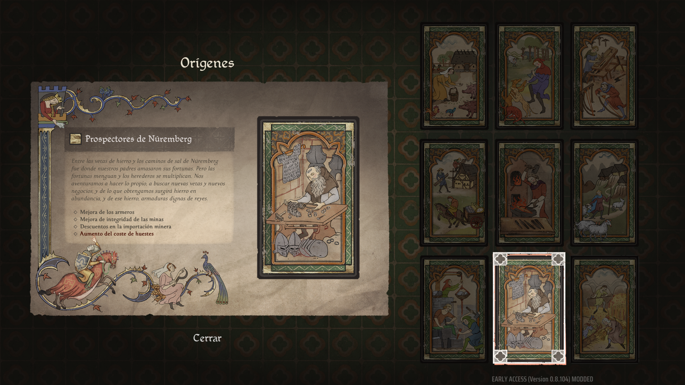
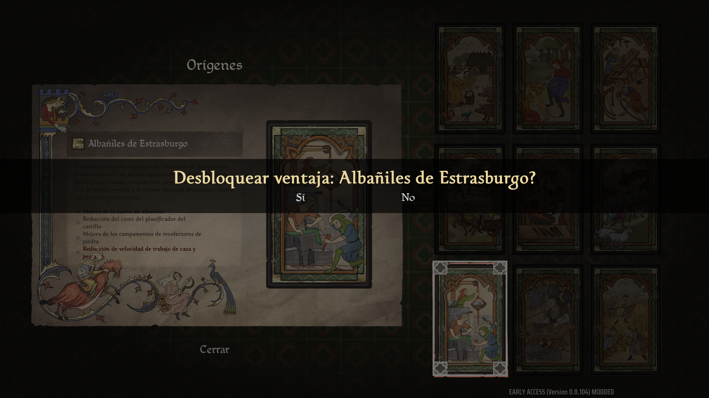
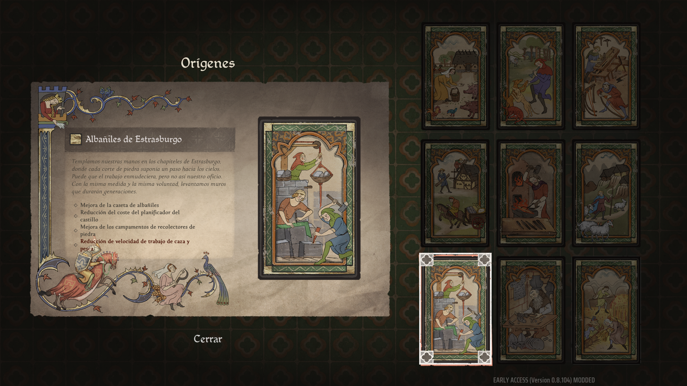

# Manor Lords: OriginSwapper

[-blue.svg)](https://store.steampowered.com/app/1363080/Manor_Lords/)

[English](#english) | [Español](#español)

---

## English

A native mod for Manor Lords (v0.8.x, Unreal Engine 5.5) that respecs your settlement's locked origin mid-game without restarting your playthrough or corrupting save files.

### Screenshots
| 1. Before (Locked Nuremberg) | 2. In-Game Unlock Dialog | 3. After (Strasbourg Masons) |
|---|---|---|
|  |  |  |

### Features
- Respecs settlement origins mid-game between any of the 9 Tier-1 choices.
- Triggers the native in-game confirmation dialog to update settlement modifiers and UI cards in real time.
- Saves through the native `UIoHandler` pipeline to preserve save file compression and structure.
- Configurable via `config.ini` (select by number 1-9 or internal name).
- Configurable hotkey (default: `F6`).
- Event-driven execution in under 1 ms.

### Origin Reference Table
| ID | Name | Internal Identifier | Focus |
|---|---|---|---|
| 1 | Bamberg Smallholders | `BambergSmallholders` | Agriculture and small plots |
| 2 | Of The Vogtland | `OfTheVogtland` | Forestry and timber yield |
| 3 | Woodwrights of Franconia | `WoodwrightsOfFranconia` | Carpentry and construction speed |
| 4 | Regensburg Guildsmen | `RegensburgGuildsmen` | Trade routes and artisan proficiency |
| 5 | Smiths of Passau | `SmithsOfPassau` | Metallurgy, armaments, and tools |
| 6 | Born of the Alps | `BornOfTheAlps` | Mountain terrain, livestock, and wool |
| 7 | Strasbourg Masons | `StrasburgMasons` | Stone gathering and masonry discounts |
| 8 | Nuremberg Prospectors | `NurembergProspectors` | Deep iron mining and armorers |
| 9 | Weiden Hinterlanders | `WeidenHinterlanders` | Foraging, hunting, and wild food |

### Installation
Prerequisite: Install [UE4SS](https://github.com/UE4SS-RE/RE-UE4SS/releases) into `ManorLords/Binaries/Win64/`.

1. Copy the `OriginSwapper` folder into `<GamePath>/ManorLords/Binaries/Win64/ue4ss/Mods/OriginSwapper/`
2. Open `<GamePath>/ManorLords/Binaries/Win64/ue4ss/Mods/mods.txt` and add: `OriginSwapper : 1`
3. In `<GamePath>/ManorLords/Binaries/Win64/ue4ss/UE4SS-settings.ini`, set `bUseUObjectArrayCache = false` to prevent UE5.5 level-transition crashes.

### Usage
1. In `ue4ss/Mods/OriginSwapper/config.ini`, set `TargetOrigin` (e.g. `TargetOrigin = 7` for Strasbourg Masons).
2. Launch Manor Lords and load your save.
3. Open the **Origins** panel by clicking your village name on the top bar.
4. Press `F6` (or your configured hotkey).
5. Confirm the in-game prompt (*"Unlock perk: [Origin Name]?"*).
6. Close the Origins panel, open the pause menu (Escape), and click **Save Game**.

### Technical Architecture
- **Memory model:** Each settled region actor (`ARegion`) delegates perk management to an attached `UPerkComponent`.
- **Save structure:** Region data serializes into `FSavedRegion`, storing active perks in `TMap<int32, FName> ActivePerks`.
- **Save engine:** Manor Lords saves through a custom C++ handler (`UIoHandler::SaveGameToSlot` / `UIoHandler::SaveDataToSlot`) rather than `UGameplayStatics`.
- **UI confirmation:** OriginSwapper invokes `SetSelectedPerkName()`, `ConfirmPerkSelection()`, and `PerkSelectionAccepted()` on `URegionDevelopmentPerksPanel` via UE4SS reflection so the engine updates active economic modifiers.

### Experimental Attributes
The same reflection interface can inspect and modify other `ARegion` / `FSavedRegion` fields. These are documented for reference and remain experimental/untested:
- `devPoints`: Unspent development points.
- `SettlementLevel`: Settlement level progression.
- `regionalWealth`: Town treasury.
- `Approval`: Settlement approval rating.
- `publicOrder`: Public order rating.
- `taxRates` / `policiesSigned`: Tax rates and active signed policies.
- `claimCost` / `isSettled`: Territorial claim costs and region status.

---

## Español

Mod nativo para Manor Lords (v0.8.x, Unreal Engine 5.5) que permite cambiar el origen bloqueado de tu asentamiento en mitad de una partida sin reiniciar ni corromper los archivos de guardado.

### Capturas de pantalla
| 1. Antes (Núremberg bloqueado) | 2. Cuadro de confirmación | 3. Después (Albañiles de Estrasburgo) |
|---|---|---|
|  |  |  |

### Características
- Cambia entre cualquiera de los 9 orígenes de Tier 1 durante la partida.
- Dispara el cuadro de diálogo nativo del juego para actualizar las bonificaciones económicas y las cartas de la interfaz en tiempo real.
- Guarda a través del canal nativo `UIoHandler`, preservando la compresión y estructura original del guardado.
- Configurable mediante `config.ini` (selección por número del 1 al 9 o por nombre interno).
- Atajo de teclado configurable (por defecto: `F6`).
- Ejecución orientada a eventos en menos de 1 ms.

### Tabla de referencia de orígenes
| ID | Nombre en español | Identificador interno | Especialización |
|---|---|---|---|
| 1 | Pequeños propietarios de Bamberg | `BambergSmallholders` | Agricultura y huertos |
| 2 | Del Vogtland | `OfTheVogtland` | Silvicultura y madera |
| 3 | Carpinteros de Franconia | `WoodwrightsOfFranconia` | Carpintería y velocidad de construcción |
| 4 | Gremialistas de Ratisbona | `RegensburgGuildsmen` | Rutas comerciales y producción artesanal |
| 5 | Herreros de Passau | `SmithsOfPassau` | Metalurgia, armamento y herramientas |
| 6 | Nacidos de los Alpes | `BornOfTheAlps` | Terreno montañoso, pastos y ganado |
| 7 | Albañiles de Estrasburgo | `StrasburgMasons` | Extracción de piedra y descuentos de cantería |
| 8 | Prospectores de Núremberg | `NurembergProspectors` | Minería de hierro profunda y armeros |
| 9 | Pobladores de Weiden | `WeidenHinterlanders` | Recolección, caza y comida silvestre |

### Instalación
Requisito previo: Instalar [UE4SS](https://github.com/UE4SS-RE/RE-UE4SS/releases) en `ManorLords/Binaries/Win64/`.

1. Copia la carpeta `OriginSwapper` en `<RutaDelJuego>/ManorLords/Binaries/Win64/ue4ss/Mods/OriginSwapper/`
2. Abre `<RutaDelJuego>/ManorLords/Binaries/Win64/ue4ss/Mods/mods.txt` y añade: `OriginSwapper : 1`
3. En `<RutaDelJuego>/ManorLords/Binaries/Win64/ue4ss/UE4SS-settings.ini`, establece `bUseUObjectArrayCache = false` para evitar cierres en UE5.5 durante cambios de nivel.

### Uso
1. En `ue4ss/Mods/OriginSwapper/config.ini`, define `TargetOrigin` (por ejemplo `TargetOrigin = 7` para Albañiles de Estrasburgo).
2. Inicia Manor Lords y carga tu partida.
3. Abre el panel de **Orígenes** pulsando sobre el nombre de tu aldea en la barra superior.
4. Pulsa `F6` (o el atajo configurado).
5. Confirma el cuadro emergente (*"¿Desbloquear ventaja: [Nombre del Origen]?"*).
6. Cierra el panel de Orígenes, abre el menú de pausa (Escape) y pulsa **Guardar partida**.

### Arquitectura técnica
- **Modelo en memoria:** Cada actor de región poblada (`ARegion`) delega la gestión de ventajas a un componente `UPerkComponent`.
- **Estructura del guardado:** Los datos de la región se serializan en `FSavedRegion`, almacenando las ventajas activas en `TMap<int32, FName> ActivePerks`.
- **Motor de guardado:** Manor Lords guarda mediante un controlador C++ propio (`UIoHandler::SaveGameToSlot` / `UIoHandler::SaveDataToSlot`) en lugar de `UGameplayStatics`.
- **Confirmación en interfaz:** OriginSwapper llama a `SetSelectedPerkName()`, `ConfirmPerkSelection()` y `PerkSelectionAccepted()` en `URegionDevelopmentPerksPanel` mediante reflexión de UE4SS para que el motor actualice los multiplicadores económicos activos.

### Atributos experimentales
Esta misma interfaz de reflexión permite inspeccionar y modificar otros campos de `ARegion` y `FSavedRegion`. Se documentan como referencia técnica y se consideran experimentales / no probados:
- `devPoints`: Puntos de desarrollo disponibles.
- `SettlementLevel`: Nivel de desarrollo del asentamiento.
- `regionalWealth`: Riqueza regional de la aldea.
- `Approval`: Nivel de aprobación de la población.
- `publicOrder`: Índice de orden público.
- `taxRates` / `policiesSigned`: Tipos impositivos y leyes activas.
- `claimCost` / `isSettled`: Coste de reclamación e inicialización de regiones vecinas.

---

## License

This project is licensed under the [MIT License](LICENSE).
